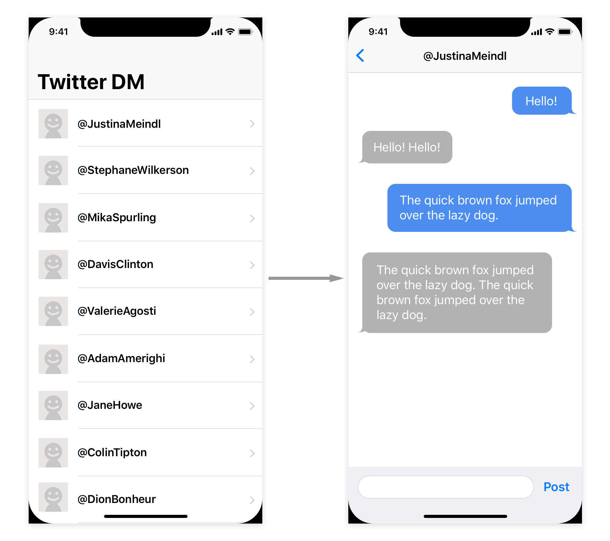

# Task

Using one of the two hypothetical scenarios below, please write a simple Twitter Direct Messaging app.

# Scenario

* Please select A or B as the scenario in which you will build your app.
* Please write which scenario you selected in your README.md file, as well as a brief summary regarding how you based your app around it. 
* Your choice of scenario A or B itself has no impact on your evaluation.

## A. Coach a junior engineer

A junior iOS engineer has joined your team. To coach this engineer, you're going to demonstrate implementing a sample app. The structure of the app should be as simple as possible.

## B. Design and implement an app as a long term project

You are tech-lead of an iOS team with 5 members, who is planning on developing a new iOS app. It will be a long term project, with both development and maintenance being handled within the team. Before starting development with your team members, you are going to design the app and as the tech lead, implement the main fundamental functionalities.

# Minimum Specifications
* Show a list of followers retrieved from any publicly available Twitter user account on the initial screen.
    * Make sure to show each user's Twitter handle (i.e., their account name with the '@' prefix) and their profile image on this screen.
    * Use the [GET followers/list](https://developer.twitter.com/en/docs/accounts-and-users/follow-search-get-users/api-reference/get-followers-list) endpoint to retrieve the list of followers. (Please refer to [Application-only authentication](https://developer.twitter.com/en/docs/basics/authentication/overview/application-only) for using this API.)
* Tapping any of these followers will transition to a direct messaging (DM) screen.
* The user can virtually send/receive messages to/from the follower on the message screen.
  * Please do NOT actually call the Twitter API at this point.
  * Implement a dummy post and response.
    * The follower echoes a message sent by the user after a second.
    * The follower’s echo text repeats the user’s message twice, e.g. echo “Hi. Hi.” for message “Hi.”
* Please refer to “Minimum Specifications for Screens” for UI specifications.

# Additional Optional Specifications
If you wish, you may consider incorporating these extra features. They are not required, but any additional features will be considered in your evaluation.

* Improving the UI to look more like the official Twitter app.
* Persisting message history between app launches.
* Anything else you would like to add.

# Minimum Screen Specifications



# Requirements

* Xcode: Please use the latest version of Xcode that is available on the Mac App Store.
* Language: Swift or Objective-C
    * While we prefer Swift, please write in the language in which you are most comfortable. If you write in Objective-C, we may ask you about your Swift ability in a follow-up interview.
    * The language version must be the latest one supported by the version of Xcode you are using.
* Deployment Target: The latest iOS version
* Please do NOT use external libraries/frameworks 
    * Use only the system iOS/Cocoa Touch frameworks.
* Use the attached `left_bubble.png` and `right_bubble.png` assets as the background images for your Twitter DM messages UI.

# Items to Submit

* Please configure your project/workspace to be able to run the app simply by choosing Product > Run in Xcode.
* Please submit a ZIP archive of both the directory containing your app project and your README.md file.

---

# Skill Test Resources

```
resources
├── left_bubble.png
├── left_bubble@2x.png
├── left_bubble@3x.png
├── right_bubble.png
├── right_bubble@2x.png
└── right_bubble@3x.png

0 directories, 6 files
```
